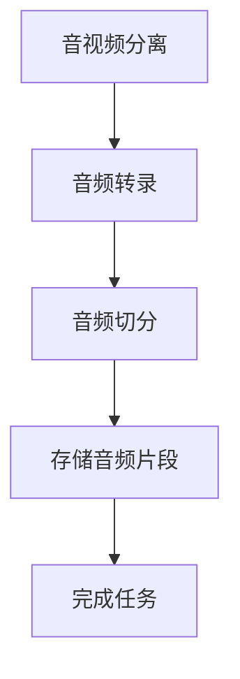

# 音频切分服务重构方案

## 概述

将 `waveshift-tts-engine/core/audio_segmenter.py` 重构为独立的容器化服务 `waveshift-audio-segment-worker`，并集成到现有的 WaveShift 工作流中。

## 架构设计

### 🏗️ 服务架构

```
waveshift-audio-segment-worker/
├── src/
│   ├── index.ts              # Worker 入口点 (WorkerEntrypoint)
│   ├── container.ts          # Container 类定义
│   └── types.ts              # TypeScript 类型定义
├── audio-segment-container/
│   ├── src/
│   │   └── main.py          # Python FastAPI 容器服务
│   ├── requirements.txt     # Python 依赖
│   └── Dockerfile          # 容器构建文件
├── wrangler.jsonc          # Cloudflare Workers 配置
├── package.json            # Node.js 项目配置
└── deploy.sh               # 部署脚本
```

### 🚀 技术栈

- **Worker**: TypeScript + Cloudflare Workers + Hono + WorkerEntrypoint
- **Container**: Python 3.11 + FastAPI + pydub + ffmpeg + boto3
- **存储**: Cloudflare R2 Object Storage
- **部署**: Docker Container + Cloudflare Containers

## 核心功能

### 🎯 智能音频切分

1. **说话人分组**: 根据转录数据中的说话人信息自动分组
2. **时长控制**: 可配置目标时长（默认10秒）和最小时长（默认3秒）
3. **重叠处理**: 自动合并重叠的音频时间段
4. **音质优化**: 支持 padding、淡入淡出、音频标准化

### 🔄 集成流程



## API 接口

### WorkerEntrypoint 方法

```typescript
interface AudioSegmentService {
  segment(params: {
    audioKey: string;              // R2 中的音频文件
    transcripts: TranscriptItem[]; // 转录数据
    goalDurationMs?: number;       // 目标时长（毫秒）
    minDurationMs?: number;        // 最小时长（毫秒）
    paddingMs?: number;            // padding（毫秒）
    outputPrefix: string;          // 输出路径前缀
  }): Promise<AudioSegmentResponse>;
}
```

### 响应格式

```typescript
interface AudioSegmentResponse {
  success: boolean;
  segments?: AudioSegment[];              // 音频片段列表
  sentenceToSegmentMap?: Record<number, string>; // 句子到片段的映射
  error?: string;
}
```

## 部署配置

### 1. 环境变量

```bash
# 必需的环境变量
CLOUDFLARE_API_TOKEN=your-api-token
CLOUDFLARE_ACCOUNT_ID=your-account-id
R2_ACCESS_KEY_ID=your-r2-access-key
R2_SECRET_ACCESS_KEY=your-r2-secret-key
R2_BUCKET_NAME=waveshift-media
R2_PUBLIC_DOMAIN=media.waveshift.net
```

### 2. Service Binding 配置

在 `waveshift-workflow/wrangler.jsonc` 中：

```json
{
  "services": [
    {
      "binding": "AUDIO_SEGMENT_SERVICE",
      "service": "waveshift-audio-segment-worker", 
      "environment": "production",
      "entrypoint": "AudioSegmentWorker"
    }
  ]
}
```

### 3. 容器配置

```json
{
  "containers": [{
    "name": "waveshift-audio-segment-container",
    "class_name": "AudioSegmentContainer", 
    "image": "./audio-segment-container/Dockerfile",
    "instance_type": "standard",
    "max_instances": 3
  }]
}
```

## 部署步骤

### 🚀 快速部署

```bash
# 1. 部署音频切分服务
cd waveshift-audio-segment-worker
npm install
npm run deploy

# 2. 重新部署工作流服务（更新 Service Binding）
cd ../waveshift-workflow
npm run deploy

# 3. 或使用根目录统一部署
npm run deploy:audio-segment
```

### 🔧 本地开发

```bash
# 1. 启动容器服务
cd waveshift-audio-segment-worker/audio-segment-container
docker build -t audio-segment-container .
docker run -p 8080:8080 audio-segment-container

# 2. 启动 Worker（新终端）
cd ../
npm run dev

# 3. 测试
curl http://localhost:8787/health
```

## 工作流集成

### 📊 工作流步骤

1. **音视频分离** (FFmpeg Worker)
2. **音频转录** (Transcribe Worker) 
3. **音频切分** (Audio Segment Worker) ← **新增**
4. **清理临时文件**
5. **完成任务**

### 💾 数据流

```
转录数据库 → 音频切分服务 → R2存储 → 音频片段文件
```

## 优势对比

### ✅ 容器化架构优势

| 特性 | 原架构 (Python脚本) | 新架构 (Container服务) |
|------|-------------------|---------------------|
| **扩展性** | 本地单机处理 | 云端弹性扩展 |
| **资源管理** | 受限于本地资源 | 独立的容器资源 |
| **工具依赖** | 需要本地安装 pydub/ffmpeg | 容器内置所有依赖 |
| **并发处理** | 单线程处理 | 多实例并行处理 |
| **故障隔离** | 影响整个应用 | 独立服务，故障隔离 |
| **部署复杂度** | 需要环境配置 | 一键容器化部署 |

### 🎯 算法优化

- **智能分组**: 基于说话人和时间连续性
- **时长优化**: 自动调整到理想的训练时长
- **音质提升**: 专业的音频处理管道
- **存储管理**: 统一的 R2 存储策略

## 性能特点

### 📈 处理能力

- **并发处理**: 最多 3 个容器实例同时运行
- **内存优化**: 使用标准实例（4GB RAM）
- **处理速度**: 异步并行处理音频切片
- **存储效率**: 直接存储到 R2，无本地临时文件

### 🔄 容错机制

- **自动重试**: Workflow 步骤自动重试机制
- **优雅降级**: 音频切分失败不影响转录结果
- **健康检查**: 容器健康状态监控
- **日志追踪**: 完整的处理日志

## 监控与调试

### 📊 日志查看

```bash
# 查看 Worker 日志
wrangler tail waveshift-audio-segment-worker

# 查看工作流日志
wrangler tail waveshift-workflow
```

### 🔍 健康检查

```bash
# 检查服务状态
curl https://waveshift-audio-segment-worker.your-account.workers.dev/health

# 检查容器状态
curl https://waveshift-audio-segment-worker.your-account.workers.dev/health
```

## 故障排除

### 🔧 常见问题

1. **容器启动失败**
   - 检查 Docker 环境
   - 验证 Python 依赖安装
   - 查看容器日志

2. **Service Binding 调用失败**
   - 确认服务已正确部署
   - 检查 WorkerEntrypoint 配置
   - 验证类型定义匹配

3. **R2 存储权限问题**
   - 确认 R2 访问密钥配置
   - 检查 CORS 策略设置
   - 验证桶权限设置

## 总结

这个重构方案将原本的本地 Python 脚本转换为云原生的容器化服务，实现了：

- **🏗️ 架构升级**: 从单体脚本到微服务架构
- **☁️ 云原生**: 利用 Cloudflare 的容器和 Workers 平台
- **🔄 工作流集成**: 无缝集成到现有工作流中
- **📈 性能提升**: 并发处理和弹性扩展
- **🛡️ 可靠性**: 容错机制和健康监控

通过这个重构，音频切分功能不仅保持了原有的核心算法，还获得了云服务的所有优势，为未来的语音合成和 AI 处理提供了强有力的基础设施支持。